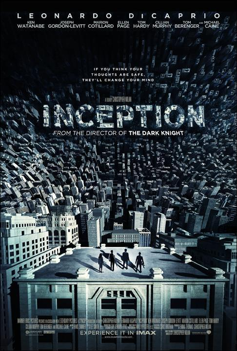
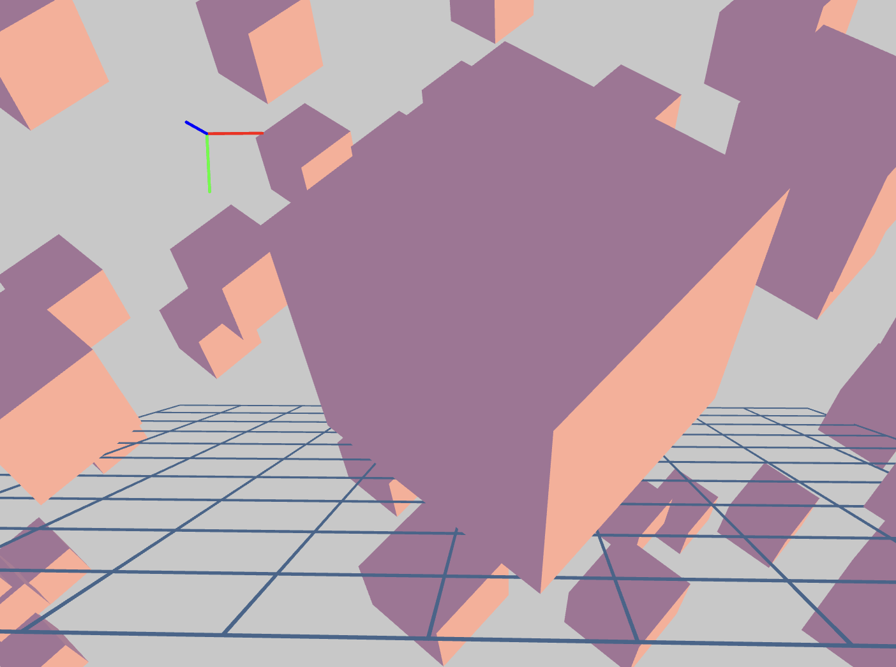
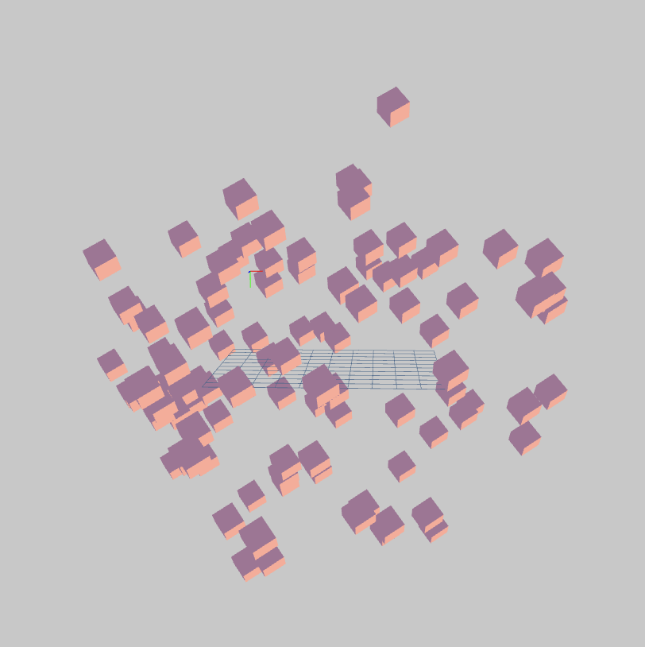
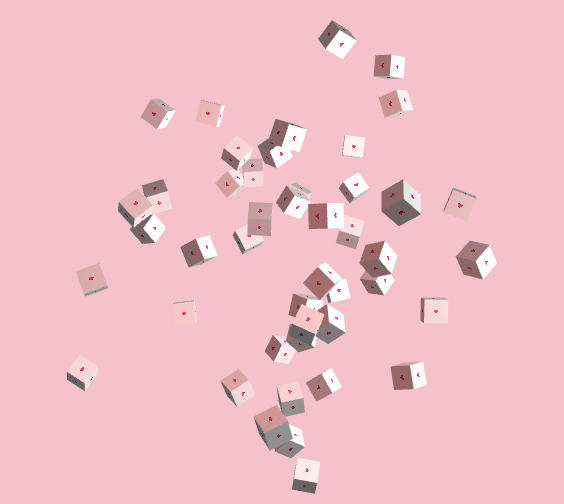

# xzha9389_9103_tut5

Make a change
another one

# Wow Image

**SAN JUAN MOUNTAINS**

# Week 8 Quiz #

- **Inspiration**

I Got inspiration from the movie [" Inception "](https://images.app.goo.gl/Swnh3Qr76KTiFvzF7)

I want to break the image into cubes, and arrange them on separate layers within a larger box. The overall concept is similar to the movie 'Inception,' where each layer has different elements but can be collapsed into a single space. When the user's mouse zooms in, they see small squares of different images, and when they zoom out, they see the whole image, similar to a Rubik's Cube. This design is useful for the assignment because it incorporates user input and allows users to control their perspective with the mouse. Additionally, we can use a random seed to vary the number of cubes, meeting the assignment requirements.

- **Coding Technique Exploration - WebGL**

> [This is the reference hyperlink to Example 1](https://openprocessing.org/sketch/2006354)

> [This is the reference hyperlink to Example 2](https://openprocessing.org/sketch/1463664)

